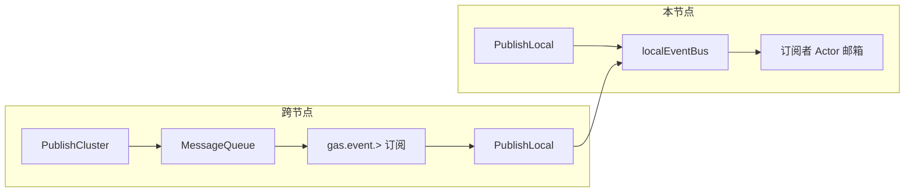

# Actor 事件总线（本地与集群）

本文档说明 GAS 中基于 topic 的轻量事件机制：在 Actor 上下文中订阅、在本节点或经消息队列跨节点发布，以及回调的执行线程模型。

---

## 1. 能力概览

| 能力 | 说明 |
|------|------|
| **Subscribe** | 以**当前 Actor**（`ctx.ID()`）为订阅者，绑定 `EventHandler`。 |
| **PublishLocal** | 仅在本节点总线内分发，不向 MQ 发送。 |
| **PublishCluster** | 将事件经集群传输（如 NATS）发布；各节点收到后**再对本机做一次 `PublishLocal`**。 |

`iface.ISystem` 与 `iface.IContext` 均暴露上述接口：`IContext` 的 `Subscribe` 隐含订阅者为当前 Actor；`PublishLocal` / `PublishCluster` 委托本节点 `ISystem`。

---

## 2. 接口与类型

- **`EventHandler`**：`func(topic string, payload []byte)`。由总线通过 `SubmitTask` 投递，在**订阅者 Actor 的邮箱协程**中执行（与 `OnMessage` 同线程模型）。
- **`IEventSubscription`**：调用 `Unsubscribe()` 取消本 topic 上该条订阅。

底层总线接口见 `internal/iface/event.go` 中的 `IEventBus`：`Subscribe(topic, subscriber *Pid, handler)` 要求 `subscriber` 为本节点 Actor；`IContext.Subscribe` 即传入 `ctx.ID()`。

---

## 3. 本地事件（`actor.NewSystem`）

- 使用嵌入的 **`localEventBus`**：`PublishLocal` 按 topic 查找所有订阅，对每个订阅者复制 topic/payload，并 `SubmitTask` 到对应 `Pid`。
- 同一 topic 可有多名订阅者；彼此独立投递。
- **`PublishCluster` 在未挂载集群传输时固定返回 `ErrEventNoCluster`**（见 `internal/actor/event_bus.go`）。

约束与错误（节选）：空 topic、空 handler、跨节点 Pid 订阅等会返回对应错误（如 `ErrEventTopicEmpty`、`ErrEventSubscriberNode`）。

---

## 4. 集群事件（`actor.NewClusterSystem`）

集群系统在 `internal/actor/cluster_system.go` 中实现：

1. **发布**：`PublishCluster` 将 `pb.EventEnvelope`（`topic`、`payload`、`source_node`）用本系统 `Serializer` 序列化，再对 MQ subject **`gas.event.` + topic** 调用 `PublishSubject`。
2. **订阅**：启动时对模式 **`gas.event.>`** 订阅（与节点收件箱用的数字 subject 隔离）。
3. **接收**：MQ 回调中反序列化为 `EventEnvelope`，再调用本机 **`PublishLocal(env.Topic, env.Payload)`**，从而走与纯本地相同的订阅表与邮箱投递。

因此：**集群只做「广播 + 各节点本地分发」**；业务侧仍用逻辑 topic 字符串，无需直接拼 MQ subject。

---

## 5. 流程简图



---

## 6. 示例与测试

完整可运行示例与集成测试见 **`examples/event/event_test.go`**，其中包括：

- 本节点 `PublishLocal` 与 `ctx.Subscribe`；
- 取消订阅后不再收到事件；
- 同一 topic 多订阅者；
- 双 `ClusterSystem` + Consul/NATS 时的 `PublishCluster`（环境不可用时相关用例会 `Skip`）。

运行：

```bash
go test ./examples/event/... -count=1 -v
```

---

## 7. 与 `pkg/lib/event` 的区别

本仓库存在两套名称相近、用途不同的「事件」能力，请勿混淆：

| | **Actor 事件总线**（本文档） | **`pkg/lib/event.Listener`** |
|---|------------------------------|-----------------------------|
| **定位** | 框架内 topic + `[]byte`，与 Actor 邮箱、`IContext.Subscribe` 集成 | 泛型 `Listener[V]`，进程内同步回调列表 |
| **执行模型** | 经 `SubmitTask` 在**订阅者 Actor 邮箱协程**中串行执行 | `Notify` 在**调用方 goroutine** 内同步遍历 handler |
| **跨节点** | 支持 `PublishCluster`（经 MQ + 各节点 `PublishLocal`） | 无，仅本进程 |
| **典型用途** | 业务领域事件、节点间广播 | 组件内部钩子、UI/配置变更通知等轻量监听 |

详见 `docs/lib.md` 中 **2.12 event** 小节。

---

## 8. `PublishLocal` 与负载大小

`PublishLocal` 会对**每个订阅者**复制一份 `payload` 再投递到对应 Actor 邮箱，以保证隔离与线程安全。在高 QPS、大 body 或单 topic 订阅者很多时，内存与调度开销会放大。

**建议**：优先传递**小消息**（如 ID、版本号、短通知）；若必须传较大数据，考虑只传引用（键名、路径）由订阅方自行加载，或评估专用数据通道。

---

## 9. 实现索引

| 内容 | 位置 |
|------|------|
| 本地总线与常量前缀 | `internal/actor/event_bus.go` |
| 集群发布/订阅与 `EventEnvelope` 投递 | `internal/actor/cluster_system.go` |
| `IContext` 上的 Subscribe/Publish* | `internal/actor/context.go` |
| MQ 载荷定义 | `api/pb/actor.proto`（`EventEnvelope`） |
