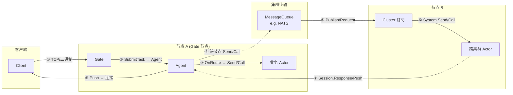
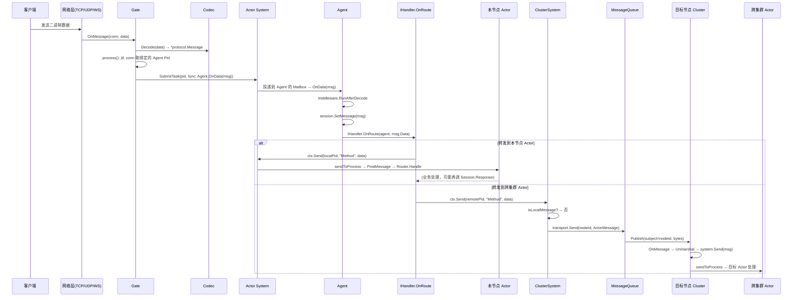
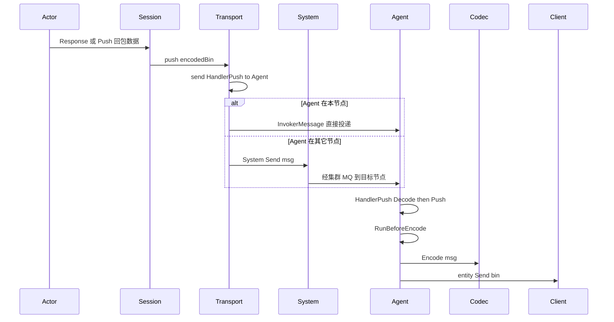
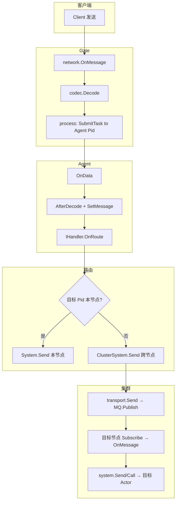

# 消息流程图：Client → Gate → Agent → 跨集群 Actor

本文档描述 GAS 框架中从客户端到网关、Agent，再到本节点或跨集群 Actor 的消息流向，以及反向回包路径。

---

## 1. 总体流程概览

---

## 2. 上行：Client → Gate → Agent → Actor（详细）

---

## 3. 组件职责与关键代码位置

| 环节 | 组件/文件 | 行为 |
|------|-----------|------|
| 入连接 | `gate/gate.go` | `onConnect`: 为每条连接 `Spawn(agent.New(...))`，将 **Pid 存到 conn.Context** |
| 收包 | `gate/gate.go` | `onMessage`: `codec.Decode(data)` 得到 `*protocol.Message`，循环 `process(conn, msg)` |
| 投递到 Agent | `gate/gate.go` | `process`: `system.SubmitTask(pid, func(){ a.OnData(msg) })`，即向该连接对应的 Agent 投递任务 |
| Agent 收包 | `gate/agent/agent.go` | `OnData`: AfterDecode → `session.SetMessage(msg)` → `IHandler.OnRoute(agent, msg.Data)` |
| 路由到 Actor | 业务实现 `IHandler` | `OnRoute` 内通过 `ctx.Send(pid, method, data)` / `ctx.Call(...)` / `ctx.Forward(...)` 发往本节点或跨节点 Actor |
| 本节点发送 | `actor/system.go` | `Send(message)`: `sendToProcess(message.To, message)` → 目标 Process 的 Mailbox |
| 跨节点发送 | `actor/cluster_system.go` | `Send(message)`: 若 `!isLocalMessage` 则 `transport.Send(message.To.NodeId, message)` |
| 集群传输 | `pkg/cluster/cluster.go` | `Send(nodeId, message)`: Marshal 后 `mq.Publish(subject=nodeId, bytes)` |
| 对端收包 | `internal/component/cluster/cluster.go` | `OnMessage`: Unmarshal → `system.Send(msg)` 或 `system.Call(msg)`，本地投递到目标 Actor |

---

## 4. 下行：Actor → Agent → Client（Session 回包）

当业务 Actor（本节点或跨节点）需要向客户端推送数据时，通过 **Session** 的 transport 发回 Agent，再由 Agent 写回连接。

- **Session**：`internal/component/gate/session/session.go`，持有 `transport`（目标为 session 绑定的 Agent Pid）。
- **Transport**：`session/transport.go`，`push(bin)` → `send(agent, "HandlerPush", bin)`；同节点用 `InvokerMessage`，跨节点用 `System().Send(msg)`。
- **Agent.HandlerPush**：`agent/agent.go`，解码后调用 `Agent.Push(msg)`，再编码通过 `entity.Send(bin)` 发回客户端。

---

## 5. 数据流简图（仅上行到跨集群 Actor）

---

## 6. 小结

- **Client → Gate**：网络层回调，Gate 按连接绑定的 **Agent Pid** 用 `SubmitTask` 把解码后的 `*protocol.Message` 投递到对应 Agent。
- **Gate → Agent**：每条连接一个 Agent Actor，消息经 **AfterDecode**、**SetMessage** 后交给 **IHandler.OnRoute**。
- **Agent → Actor**：在 OnRoute 中通过 `ctx.Send` / `ctx.Call` / `ctx.Forward` 发往本节点或跨集群 Actor；跨节点时由 **ClusterSystem** 经 **MessageQueue** 发到目标节点，目标节点 **Cluster 组件** 收包后交给本地 **System.Send/Call**，最终进入目标 Actor 的 Mailbox。
- **Actor → Client**：业务通过 **Session.Response/Push** 经 **Transport** 发到对应 Agent（本节点直接投递，跨节点经 System.Send），Agent 的 **HandlerPush** 编码后通过 **entity.Send** 写回客户端。

以上流程对应代码库中的 `internal/component/gate`、`internal/actor`、`internal/component/cluster` 与 `pkg/cluster`。
